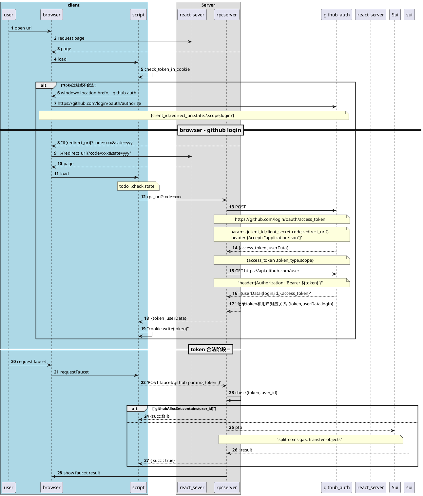
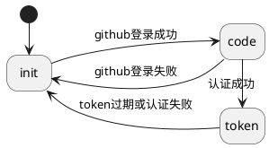

# oauth 流程
vite server 和express server
vite server处理静态页面,  express server 处理rpc请求.
这里vite serer => scriptserver   express server=>rpc server

[github auth scope](https://githubdocs.cn/en/apps/oauth-apps/building-oauth-apps/scopes-for-oauth-apps)
# 初始接入流程

# github auth state chart

认证失败可能发生在:
1. 使用code 调用auth过程  ,没有返回access_token
2. 使用token请求sui ,返回 code=invalid_token

github token有个时间10分钟,cookie可以记录

